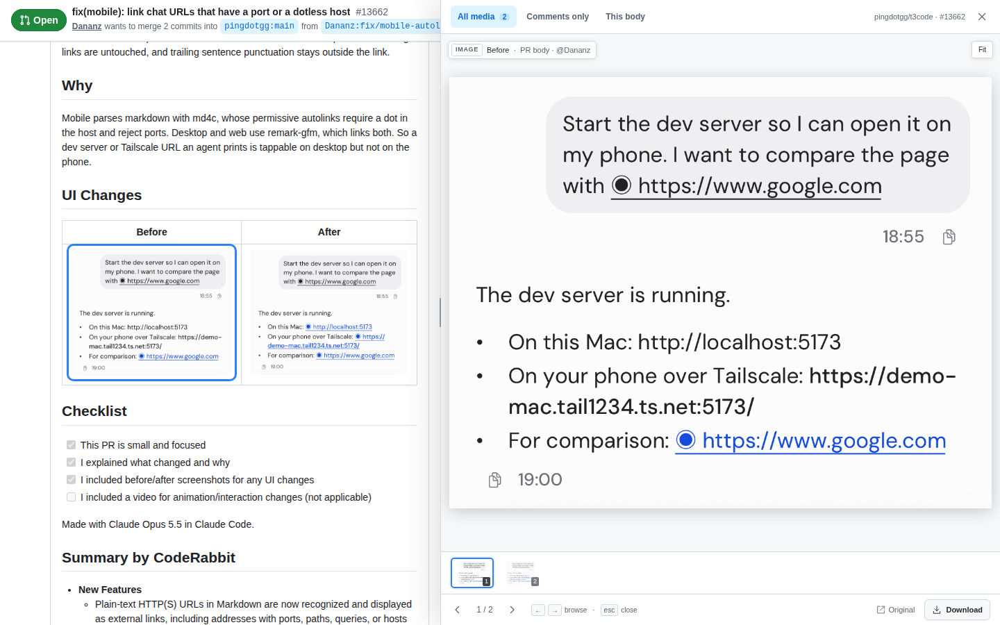
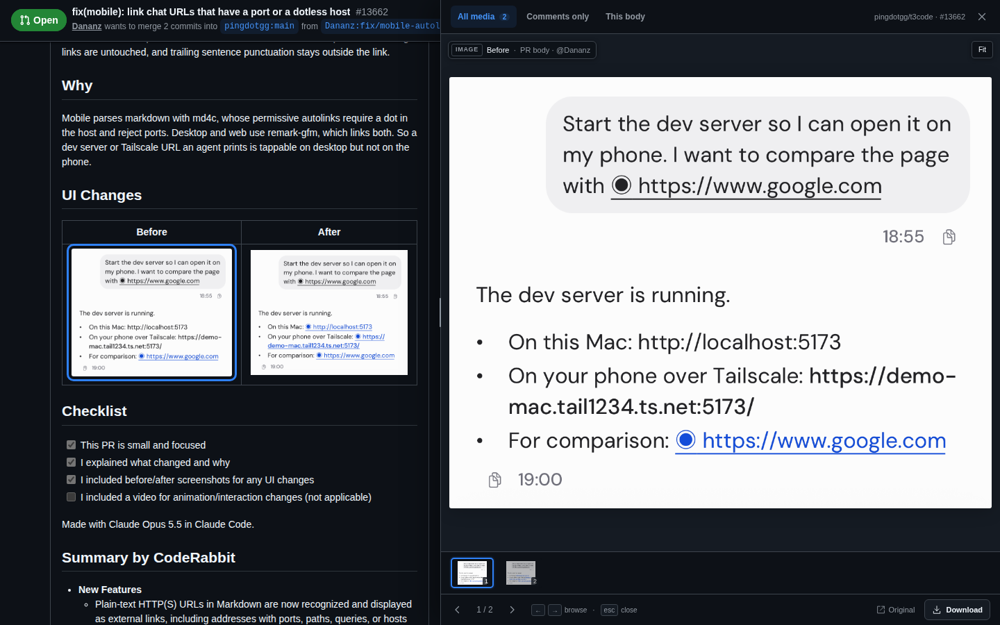

# GitHub Media Gallery

GitHub issues and pull requests often contain the evidence you need to review a change: screenshots, before/after comparisons, recordings, and short videos. That evidence is usually spread through the description and many comments. Clicking a screenshot normally takes you away from the conversation, which makes comparing several pieces of evidence slow and easy to lose.

GitHub Media Gallery keeps the conversation on the left and opens a media-only review sidebar on the right. It was made to make visual review of issues and pull requests faster: open the first image, move through every image or video with the keyboard, and let the page scroll to the corresponding source as you go. The selected source remains visible in GitHub, so you can see who posted it and what was around it without duplicating the comment text in a second panel.

It is a build-free Manifest V3 extension for Chrome-based browsers. Brave uses the same extension APIs, so the same source works in Chrome and Brave.

## What it does

- Opens at the image or video you clicked, without navigating away from GitHub.
- Finds screenshots, release-download assets, user attachments, direct media links, and native GitHub video elements in loaded issue and PR content.
- Shows the selected image or video in a fixed sidebar that covers GitHub's metadata sidebar and uses the remaining window width.
- Keeps the issue or PR conversation visible on the left and scrolls it to the active media as you navigate.
- Supports **← / →**, previous/next buttons, thumbnails, wrapping navigation, and **Esc** to close.
- Filters **All media**, **Comments only**, and **This comment** (or **This body** when the selected asset is in the issue/PR description). The source dropdown can select a different comment.
- Plays supported videos in the sidebar, with native controls and keyboard behavior.
- Provides **Fit**, **Original**, and **Download** actions.
- Resizes from the divider, including with the divider's keyboard arrow controls.
- Follows GitHub's light, dark, dimmed, and automatic color modes.
- Does not post comments, call a backend, collect analytics, or upload media. Files remain on their original GitHub or external host.

The gallery indexes media GitHub has loaded. If a comment is collapsed or GitHub has not loaded older comments yet, expand or load it and the extension will rescan automatically.

## Screenshots

This is the gallery opened on the public test PR [`pingdotgg/t3code#13662`](https://github.com/pingdotgg/t3code/pull/13662). The conversation remains visible on the left, while the media-only sidebar overlaps the metadata sidebar on the right.

### Light mode



### Dark mode



In both screenshots, the selected screenshot is the first item in the PR body. The **All media** count is visible, the second thumbnail is available for navigation, and the GitHub source is still visible behind the sidebar.

## Test fixture issue

Use [Test Issue #1](https://github.com/jeroenpg/github-issue-pr-media-viewer/issues/1) to try the extension. It contains lorem ipsum text, two screenshots in the issue body, and additional screenshots in comments so the **Comments only** and **This comment** filters can be tried safely.

## Install from source in Brave or Chrome

1. Download or clone this folder. You need the directory containing `manifest.json`; no build step is required.
2. Open the extensions page:
   - Brave: `brave://extensions`
   - Chrome: `chrome://extensions`
3. Turn on **Developer mode**.
4. Click **Load unpacked**.
5. Select this project folder.
6. Pin **GitHub Media Gallery** from the extensions menu if you want the toolbar button to stay visible.
7. Open any issue or pull request on `github.com`. Click an image, video, or the extension icon.

After editing the source, return to the extensions page and click the extension's **Reload** button. Refresh the GitHub tab if it was already open before reloading the extension. You can also install the generated ZIP without publishing it: run `npm run package`, extract `dist/github-media-gallery-0.1.0.zip`, then choose the extracted directory with **Load unpacked**.

The default toolbar shortcut is **Alt+Shift+G**. Change it at `brave://extensions/shortcuts` or `chrome://extensions/shortcuts`.

## Install prompt for any coding agent

Paste this into Claude Code, Codex, OpenCode, or another coding agent:

```text
Install and verify the GitHub Media Gallery extension from https://github.com/jeroenpg/github-issue-pr-media-viewer.

Clone the repository into a temporary working directory. Run `npm ci`, `npm run check`, `npm test`, and `npm run package`. Load the folder containing `manifest.json` into Brave or Chrome as an unpacked extension. If you can control the browser, use a fresh Chromium profile with `--disable-extensions-except=<repo-folder>` and `--load-extension=<repo-folder>`. Otherwise, tell me to open `brave://extensions` or `chrome://extensions`, enable Developer mode, click Load unpacked, and select the cloned folder.

Report the absolute install folder and test results. Do not publish the extension, modify GitHub content, post comments, or send messages.
```

## Use it

- Click an image or video in an issue or PR to open that item directly.
- Click the extension icon or press **Alt+Shift+G** to open the first item or close the gallery.
- Use **← / →** or the sidebar controls to move through the media. The page scrolls to each source.
- Choose **Comments only** to exclude the issue/PR description. Choose **This comment** to stay within the selected comment, then use the dropdown to switch to another comment.
- Drag the thin divider on the left edge of the panel to choose how much width the conversation keeps.
- Use **Original** to open the source URL in a new tab. Use **Download** to save the file through the browser's download manager.
- Press **Esc** or click **×** to close the sidebar and restore GitHub's original layout.

## Development

Runtime files are plain JavaScript and CSS. There is no bundler and no remote code:

- `media-model.js` adapts GitHub's legacy pull-request markup and modern issue markup.
- `content.js` owns scanning, filters, navigation, scrolling, video playback, and the sidebar UI.
- `content.css` adjusts the GitHub page split while the gallery is open.
- `gallery.css` styles the shadow-root UI and follows GitHub's light/dark tokens.
- `background.js` handles the toolbar action and browser downloads.

Run the checks locally:

```sh
npm ci
npm run check
npm test
npm run package
```

The Playwright tests use an isolated Brave profile and controlled GitHub-shaped fixtures. They verify media discovery, click-to-open, keyboard navigation, video playback during DOM updates, filters, source scrolling, theme switching, resizing, and route changes. They do not post anything to GitHub. Set `BROWSER_PATH` to another Chromium-compatible browser when Brave is installed somewhere else.

`npm run package` creates `dist/github-media-gallery-0.1.0.zip` containing the extension runtime, icons, screenshots, and this README.
